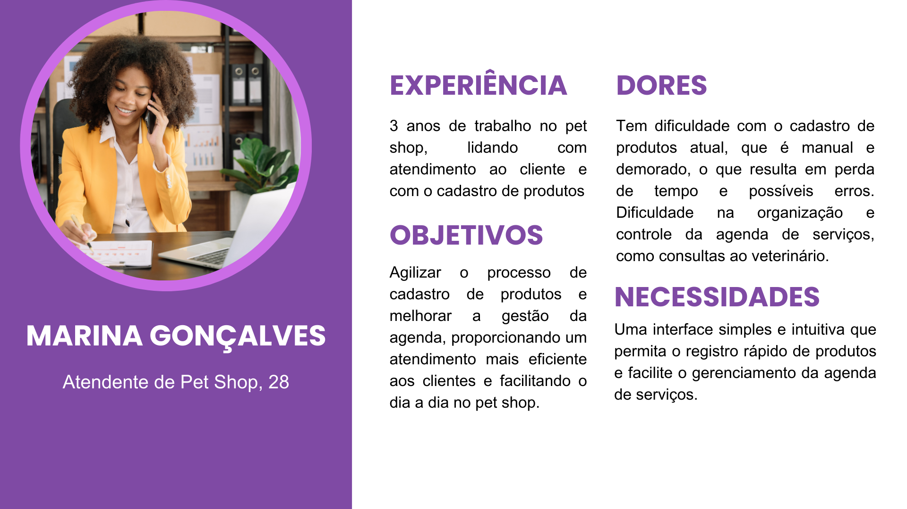

# Especificação do projeto

## Personas

### Persona 1 - Nayara Almeira - Gerente
- **Idade**: 31 anos
- **Profissão**: Gerente de pet shop
- **Experiência**: 6 anos na administração do pet shop, 8 anos atuando como veterinária
- **Dores**: Tem dificuldade com o controle atual de estoque, que é ineficiente, com o monitoramento da loja e seus funcionários à distância e com a perda recorrente de clientes.
- **Necessidades**: Acesso rápido e remoto às informações da loja, facilidade para visualizar dados financeiros e operacionais e melhor controle do estoque para evitar desperdícios e falta de produtos.
- **Objetivos**: Gerenciar o pet shop de forma eficiente, mesmo à distância, garantindo a satisfação dos clientes e a otimização dos recursos.

---

### Persona 2 - Marina Gonçalves - Atendente
- **Idade**: 28 anos
- **Profissão**: Atendente de pet shop
- **Experiência**: 3 anos de trabalho no pet shop, lidando com atendimento ao cliente e com o cadastro de produtos
- **Dores**: Tem dificuldade com o cadastro de produtos atual, que é manual e demorado, o que resulta em perda de tempo e possíveis erros. Dificuldade na organização e controle da agenda de serviços, como consultas ao veterinário.
- **Necessidades**: Uma interface simples e intuitiva que permita o registro rápido de produtos e facilite o gerenciamento da agenda de serviços.
- **Objetivos**: Agilizar o processo de cadastro de produtos e melhorar a gestão da agenda, proporcionando um atendimento mais eficiente aos clientes e facilitando o dia a dia no pet shop.

---

### Persona 3 - Ricardo Bueno - Veterinário
- **Idade**: 47 anos
- **Profissão**: Veterinário no pet shop
- **Experiência**: 14 anos de experiência em clínicas veterinárias e pet shops, realizando consultas e acompanhando o bem-estar dos animais.
- **Dores**: Tem dificuldade com alterações de última hora nos horários das consultas e com o acompanhamento da agenda e da disponibilidade de remédios e vacinas. 
- **Necessidades**: Um sistema que permita visualizar e receber notificações sobre alterações nas consultas e na agenda e controlar a disponibilidade de remédios e vacinas.
- **Objetivos**: Garantir que as consultas sejam bem agendadas e que os medicamentos e vacinas necessários estejam sempre disponíveis, permitindo um atendimento de alta qualidade aos animais.

---

### Persona 4 - Lucas Souza - Estoquista
- **Idade**: 29 anos
- **Profissão**: Estoquista do pet shop
- **Experiência**: 4 anos trabalhando com controle de estoque e organização de produtos.
- **Dores**: Tem dificuldade com o controle manual do estoque, que gera inconsistências nas quantidades de produtos disponíveis, falta de sistema eficiente para registrar entrada e saída de mercadorias e dificuldade em identificar rapidamente produtos próximos do vencimento. 
- **Necessidades**: Um sistema que automatize o controle de estoque e registre movimentações de entrada e saída, tenha alertas para produtos próximos do vencimento, acesso fácil às informações do estoque e que preveja reposições necessárias.
- **Objetivos**: Garantir que os produtos estejam sempre disponíveis para venda e atendimento, evitando desperdícios e melhorando a eficiência do pet shop.

---

### Persona 5 - Júlia Martins - Auxiliar de Atendimento
- **Idade**: 22 anos
- **Profissão**: Auxiliar de atendimento no pet shop
- **Experiência**: 2 anos trabalhando no atendimento ao cliente e apoio nas vendas de produtos para animais.
- **Dores**: Tem dificuldade na organização das informações dos clientes, especialmente quando se trata de manter o histórico de compras e preferências. Além disso, dificuldade em recomendar produtos adequados devido à falta de informações rápidas sobre o estoque disponível. 
- **Necessidades**: Um sistema que possibilite o acesso rápido aos históricos de clientes e produtos, ajudando a personalizar o atendimento e facilitar a recomendação de mercadorias.
- **Objetivos**: Proporcionar um atendimento de alta qualidade, com recomendações personalizadas para os clientes, garantindo satisfação e fidelização.

## Histórias de usuários

Com base na análise das personas, foram identificadas as seguintes histórias de usuários:

|EU COMO... `PERSONA`| QUERO/PRECISO ... `FUNCIONALIDADE` |PARA ... `MOTIVO/VALOR`                 |
|--------------------|------------------------------------|----------------------------------------|
|Gerente do pet shop  | Cadastrar e editar os dados dos funcionários no sistema | Manter a equipe organizada |
|Gerente do pet shop  | Receber alertas sobre produtos próximos ao vencimento | Evitar desperdícios e falta de estoque |
|Gerente do pet shop  | Acessar remotamente as vendas realizadas e seus valores | Acompanhar o fluxo e desempenho do pet shop |
|Gerente do pet shop  | Consultar a situação do estoque | Planejar compras e reabastecimento |
|Atendente  | Registrar novos clientes no sistema | Facilitar futuros atendimentos|
|Atendente  | Ser notificado quando a quantidade de um produto no estoque estiver baixa | Realizar a reposição a tempo |
|Estoquista  | Controlar entrada e saída de produtos de forma automática | Evitar erros no estoque |
|Estoquista  | Receber alertas sobre produtos próximos ao vencimento | Planejar reposição e evitar desperdícios |
|Auxiliar de atendimento | Acessar histórico de compras dos clientes | Personalizar atendimento e recomendações |
|Auxiliar de atendimento | Visualizar estoque disponível | Informar clientes sobre disponibilidade dos produtos |

## Requisitos

As tabelas a seguir apresentam os requisitos funcionais e não funcionais que detalham o escopo do projeto. 

### Requisitos funcionais

|ID    | Descrição do Requisito  | Prioridade |
|------|-----------------------------------------|----|
|RF-001| Permitir o cadastro de fornecedores  | ALTA | 
|RF-002| Permitir o cadastro de clientes com informações como nome, endereço e contato | BAIXA | 
|RF-003| Permitir o cadastro de funcionários com informações como nome, cargo, login e endereço | ALTA |
|RF-004| Permitir o registro de novos produtos com nome e data de validade  | ALTA |
|RF-005| Registrar vendas com detalhamento de itens, quantidade, preço e data da venda | ALTA |  
|RF-006| Atualizar automaticamente o estoque com cada venda ou movimentação  | ALTA |
|RF-007| Exibir produtos próximos do vencimento   | MÉDIA |
|RF-008| Exibir produtos com baixa quantidade	   | MÉDIA |  
|RF-009| Permitir a consulta da disponibilidade de produtos em estoque.   | MÉDIA |
|RF-010| Emitir relatórios de vendas e movimentação de produtos   | ALTA |
|RF-011| Registrar login de funcionários no sistema com credenciais(nome de usuário e senha)	  | ALTA | 
|RF-012| Validar as credenciais e conceder acesso conforme o tipo de usuário(gerente, funcionário, etc)	   | ALTA |
|RF-013| Permitir que a venda seja associada a um cliente | MÉDIA | 
|RF-014| Permitir o histórico por cliente, fornecedor, período, produto ou funcionário reponsável | MÉDIA | 
|RF-015| Permitir a consulta do histórico de vendas | ALTA |  
|RF-016| Permitir a edição dos cadastros de fornecedores, clientes, produtos e funcionários | ALTA |
|RF-017| Permitir a exclusão de registros, solicitando confirmação do usuários antes de proceder com a remoção | MÉDIA |
|RF-018| Possibilitar alteração da senha pelo usuário, mediante validação da senha atual | MÉDIA |
|RF-019| Disponibilizar funcionalidade de recuperação de senha  | MÉDIA |
|RF-020| Registrar pedidos de compra  |  MÉDIA |

### Requisitos não funcionais

|ID     | Descrição do Requisito  |Prioridade |
|-------|-------------------------|----|
|RNF-001| O sistema deve ser responsivo para rodar em dispositivos móveis | MÉDIA | 
|RNF-002| Deve processar as requisições do usuário em no máximo 3 segundos |  BAIXA | 
|RNF-003| Sua interface deve ser intuitiva para garantir que a navegação seja acessível para todos os usuários | ALTA |


|RNF-005| Senhas serão criptografadas no banco de dados | ALTA |
|RNF-006| Seu controle de acesso será baseado em papéis, onde cada colaborador terá acesso a níveis diferentes |
 MÉDIA|
|RNF-007| A aplicação será escalável, irá crescer juntamente com o crescimento das consultas e do estoque | BAIXA |

|RNF-008| Terá pilares de poo para facilitar a modularização do código e, consequentemente sua manutenção | BAIXA |

|RNF-009| Será compatível com os principais navegadores web disponíveis atualmente no mercado |
 ALTA |
|RNF-010| O sistema deve ter um plano de backup regular para garantir a recuperação em caso de falhas | ALTA |

## Restrições

O projeto está restrito aos itens apresentados na tabela a seguir.

|ID| Restrição                                             |
|--|-------------------------------------------------------|
|001| O projeto deverá ser entregue até o final do semestre |
|002| O custo total do projeto não deve exceder o orçamento definido       |
|003| A aplicação deve ficar pronta em 4 meses |
|004| Acatar a lei LGPD |
|005| Será hospedado na Azure |
|006| Ficará hospedado enquanto o projeto durar, 5 meses |
|007| Deve respeitar o limite de armazenamento do banco de dados |
|008| O sistema deve ser otimizado para funcionar em dispositivos com recursos limitados |
|009| Front end será feito usando React |
|010| Back end será feito com Spring Boot |
|011| Banco de Dados será feito com MySQL |

## Diagrama de casos de uso

  

