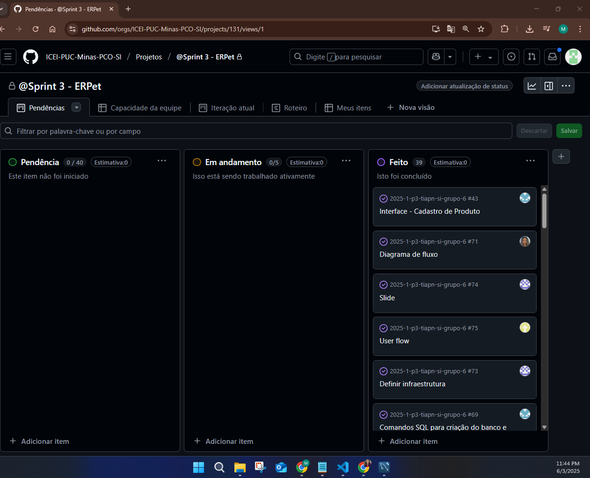

# Metodologia

Pré-requisitos: <a href="02-Especificacao.md"> Especificação do projeto</a>

Descreva aqui a metodologia de trabalho do grupo para abordar o problema. Inclua definições sobre os ambientes de trabalho utilizados pela equipe para desenvolver o projeto. Isso abrange a relação dos ambientes utilizados, a estrutura para a gestão do código-fonte, além da definição do processo e das ferramentas por meio dos quais a equipe se organiza (gestão de equipes).

## Controle de versão

A ferramenta de controle de versão adotada no projeto foi o [Git](https://git-scm.com/), sendo que o [GitHub](https://github.com) foi utilizado para hospedagem do repositório.

O projeto segue a seguinte convenção para o nome de branches:

- `main`: versão estável já testada do software
- `unstable`: versão já testada do software, porém instável
- `testing`: versão em testes do software
- `dev`: versão de desenvolvimento do software

Quanto à gerência de issues, o projeto adota a seguinte convenção para etiquetas:

- `documentation`: melhorias ou acréscimos à documentação
- `bug`: uma funcionalidade encontra-se com problemas
- `enhancement`: uma funcionalidade precisa ser melhorada
- `feature`: uma nova funcionalidade precisa ser introduzida

Discuta como a configuração do projeto foi feita na ferramenta de versionamento escolhida. Exponha como a gestão de tags, merges, commits e branches é realizada. Discuta também como a gestão de issues foi feita.

## Planejamento do projeto

###  Divisão de papéis

    
    <strong>Figura:</strong> Imagem do GitHub Projects

#### Sprint 1
- _Scrum master_: Wanessa Cristina
- Documentação: Alice Machado, Eduarda Silva, Gabriel Lucas, Maria Clara, Miriam Cristina, Wanessa Cristina

#### Sprint 2
- _Scrum master_: Míriam Cristina
- Documentação: Alice Machado, Eduarda Silva, Gabriel Lucas, Maria Clara, Miriam Cristina, Wanessa Cristina
- Desenvolvedor _Modelagem_ASIS: Alice Machado e Gabriel Alves
- Desenvolvedor _Modelagem_TOBE: Maria Clara e Wanessa Cristina
- Diferencial,gargalos e monetização: Eduarda Nunis e Miriam Cristina

#### Sprint 3
- _Scrum master_: Alice Machado
- Documentação: Alice Machado, Eduarda Silva, Gabriel Lucas, Maria Clara, Miriam Cristina, Wanessa Cristina
- Modelo lógico, comandos SQL para criação do banco e restrições, template padrão, Wireframes e interfaces Cadastro de Produto, Landing page e Tela de Conferência de XML: Alice Machado
- Slides, definir Infraestrutura, wireframes e interfaces Tela de Login e Registro de Vendas: Eduarda Nunis
- User Flow, definir tecnologias utilizadas e elaborar a figura de interação, wireframes e interfaces Cadastro de Funcionário e Tela de Relatório : Gabriel Alves
- Modelo conceitual BD, definir como será implementado no SGBD e wireframes e Interfaces Tela Inicial (Dashboard): Maria Clara
- Diagrama de classes e wireframe e Interface Cadastro de Cliente: Miriam Cristina
- Definir qualidade do software com ISO/IEC 25010, diagrama de Fluxo e wireframes e interfacesCadastro de Fornecedor e Montar Pedido de Compra: Wanessa Cristina

  #### Sprint 4
- _Scrum master_: Gabriel Alves
- Configurar Ambiente Para Projeto ERPet, documentação, slides: Alice Machado, Eduarda Silva, Gabriel Lucas, Maria Clara, Miriam Cristina, Wanessa Cristina
- Criar Apresentação de Slides para a Sprint 4: Alice Machado, Eduarda Silva, Gabriel Lucas, Maria Clara, Miriam Cristina, Wanessa Cristina
- Back end Entidade produto e implementar crud da entidade Produto: Alice Machado
- Implementar Tela de Login com validação de Senha: Eduarda Nunis
- Configurar BackEnd/FrontEnd, back End Crud Usuario, implementar CRUD da entidade Usuario, correções Sprint passada : Gabriel Alves
- Implementar CRUD da entidade Categoria: Maria Clara
- Criar Backend Entidade Cliente: Miriam Cristina
- Implementar CRUD da entidade Fornecedor: Wanessa Cristina

###  Quadro de tarefas

#### Sprint 1

Atualizado em: 13/03/2025

| Responsável   | Tarefa/Requisito                          | Iniciado em    | Prazo      | Status | Terminado em     |
| :----         |    :----                                  |      :----:    | :----:     | :----: | :----:           |
| Alice         | Histórias de usuário e Personas           | 28/02/2024     | 13/03/2025 |  ✔️   | 13/03/2025        |
| Eduarda       | Requisitos não funcionais e Restrições    | 28/02/2024     | 13/03/2025 |  ✔️   |  13/03/2025      |
| Gabriel       | Documentação de Contexto                  | 28/02/2024     | 13/03/2025 |  ✔️   |  08/03/2025      |
| Miriam        | Requisitos não funcionais e Restrições    | 28/02/2024     | 13/03/2025 | ✔️    |  13/03/2025      |
| Maria Clara   | Requisitos funcionais e Diagrama de CSU   | 28/02/2024     | 13/03/2025 | ✔️    |   13/03/2025     |
| Wanessa       | Requisitos funcionais e Diagrama de CSU   | 28/02/2024     | 13/03/2025 | ✔️    |   13/03/2025     |

#### Sprint 2

Atualizado em: 10/04/2025

| Responsável   | Tarefa/Requisito | Iniciado em    | Prazo      | Status | Terminado em    |
| :----         |    :----         |      :----:    | :----:     | :----: | :----:          |
| Alice Machado       | Modelagem AS IS  | 26/03/2025     | 10/04/2025 | ✔️    | 05/04/2025      |
| Eduarda        | Diferencial, gargalos e monetização, indicadores de desempenho  | 08/04/2025     | 10/04/2025   |  ✔️  | 08/04/2025 |   |                 |
| Eduarda        | Indicadores de desempenho  | 10/04/2025     | 10/04/2025   |  ✔️  | 10/04/2025 |   |     
| Gabriel       | Modelagem AS IS | 27/03/2025     |10/04/2025 | ✔️     |     05/04/2025            | 
| Maria Clara   | Modelagem TO BE   | 02/04/2025     | 10/04/2025 | ✔️    |   05/04/2025     |
| Miriam        | Diferencial, gargalos e monetização, indicadores de desempenho |  10/04/2025    |  10/04/2025  | ✔️    |   10/04/2025      |
| Miriam         | Indicadores de desempenho  | 10/04/2025     | 10/04/2025   |  ✔️  | 10/04/2025 |   | 
| Wanessa       | Modelagem TO BE  | 02/04/2025     | 10/04/2025 | ✔️    |   03/04/2025     |

Legenda:
- ✔️: terminado
- 📝: em execução
- ⌛: atrasado
- ❌: não iniciado

### Processo

Coloque informações sobre detalhes da implementação do Scrum seguido pelo grupo. O grupo deverá fazer uso do recurso de gerenciamento de projeto oferecido pelo GitHub, que permite acompanhar o andamento do projeto, a execução das tarefas e o status de desenvolvimento da solução.
 

## Relação de ambientes de trabalho

Os artefatos do projeto são desenvolvidos a partir de diversas plataformas. Todos os ambientes e frameworks utilizados no desenvolvimento da aplicação estão listados na seção abaixo.

### Ferramentas

Liste todas as ferramentas que foram empregadas no projeto, justificando a escolha delas, sempre que possível.

Exemplo: os artefatos do projeto são desenvolvidos a partir de diversas plataformas e a relação dos ambientes com seu respectivo propósito é apresentada na tabela que se segue.

| Ambiente                            | Plataforma                         | Link de acesso                         |
|-------------------------------------|------------------------------------|----------------------------------------|
| Repositório de código fonte         | GitHub                             | [http://....     ](https://github.com/ICEI-PUC-Minas-PCO-SI/2025-1-p3-tiapn-si-grupo-6/tree/main/src)                       |
| Documentos do projeto               | GitHub                             | [http://....    ](https://github.com/ICEI-PUC-Minas-PCO-SI/2025-1-p3-tiapn-si-grupo-6/tree/main/docs)                        |
| Modelagem                         | Miro                             |[ http://....  ](https://miro.com/welcome/WUlQZFg5OUZRWFc4RHVZZTA4ZE5BUkpsaTEvWlpTVWVhaGlGMkxDLytYN3orTFZHRXJOSkhYRFVTRTNTblByWTN0cWhyd2RuRTl6WFh4OUg3a29hbHQ2c0lpb0wybDU1Z0M1OHh6dTBySXdoSVcvdkFvQThDdjFXSGw3UUFxTnpzVXVvMm53MW9OWFg5bkJoVXZxdFhRPT0hdjE=?share_link_id=536145299240)                          |
| Projeto de interface                | Figma                              | [http://....      ](https://www.figma.com/design/ETIC16yTETDizManQhXTUP/ERPET---Telas-do-Sistema?node-id=0-1&p=f&t=06MSeQlT7Ra9PSvy-0)                      |
| Gerenciamento do projeto            | GitHub Projects                    | [http://....        ](https://github.com/ICEI-PUC-Minas-PCO-SI/2025-1-p3-tiapn-si-grupo-6/projects?query=is%3Aopen)                    |
| Hospedagem                          | Vercel                             | http://....                            |
