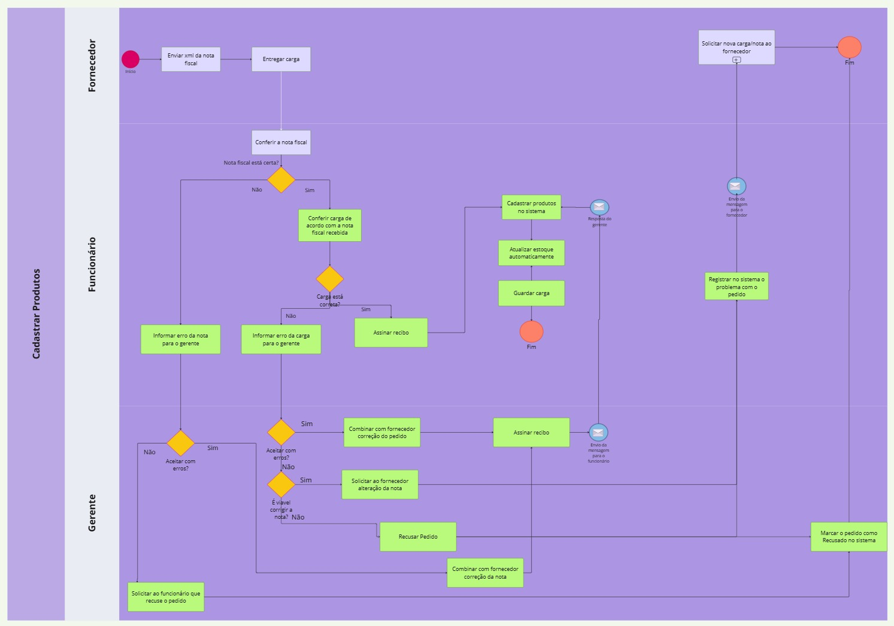

# Modelagem dos processos de negócio

Pré-requisitos: <a href="02-Especificacao.md"> Especificação do projeto</a>

## Modelagem da situação atual (Modelagem AS IS)

Descrição Textual dos Processos Atuais
1. Cadastro de Produtos:
Processo Atual:
- Recebimento da Carga: Quando uma nova carga de produtos chega ao pet shop, um funcionário é responsável por recebê-la.
- Conferência: O funcionário confere a carga recebida com a nota fiscal e assina o recibo para confirmar que tudo está em ordem.
- Armazenamento: Após a conferência, o funcionário guarda os produtos no estoque.
- Registro no Sistema: O funcionário precisa se deslocar até um computador para registrar manualmente cada produto no sistema de gestão do pet shop.
Problemas Identificados:
- Sobrecarga de Tarefas: Com o aumento do volume de produtos, os funcionários enfrentam uma sobrecarga de tarefas, resultando em desorganização.
- Gargalo no Cadastro: Se vários produtos chegam ao mesmo tempo, o processo de cadastro pode se tornar um gargalo, atrasando a atualização do estoque.
- Deslocamento Ineficiente: O deslocamento até o computador para registrar os produtos é ineficiente e consome tempo.
- Falta de Controle de Validade e Lotes: O sistema atual não controla a data de validade dos produtos nem os lotes, o que pode levar a perdas e desperdícios.

2. Venda de Produtos:
Processo Atual:
- Atendimento ao Cliente: Quando um cliente chega ao pet shop, um funcionário o recebe e pergunta sobre o produto desejado.
- Consulta de Disponibilidade: O funcionário verifica manualmente no estoque físico ou no sistema básico de gestão se o produto está disponível.
- Informação ao Cliente: Caso o produto esteja disponível, o funcionário informa o preço e as condições de pagamento ao cliente. Se não estiver, informa que não há estoque.
- Registro da Venda: Após a confirmação do cliente, o funcionário registra manualmente a venda no excel.
- Pagamento: O cliente realiza o pagamento no caixa, onde outro funcionário emite o recibo.
- Entrega do Produto: O funcionário separa o produto vendido e o entrega ao cliente, registrando o estoque no papel e depois passa para a planilha.

**Processo 1 - Cadastro de Produto**

  

**Processo 2 - Venda de Produto**

  

## Descrição geral da proposta (Modelagem TO BE)

Através da  análise dos processos AS-IS (Venda de Produtos e Cadastro de Produtos), foram identificados alguns gargalos: dependência de processos manuais, falhas na comunicação e registros paralelos em planilhas. Utilizando modelo TO BE é esperado automatizar estes processos, possibilitando a integração e oferecendo o controle centralizado da administração do petshop, otimizando as operações e promovendo melhor experiência tanto para os clientes quanto para os colaboradores da empresa.

**Processo 1 - Cadastro de Produto**

  

<em>Figura 2 – Modelo BPMN do Processo 1  TO BE com as melhorias propostas pela equipe</em>

**Processo 2 - Venda de Produto**

  

<em>Figura 2 – Modelo BPMN do Processo 1  TO BE com as melhorias propostas pela equipe</em>

**Oportunidades de melhoria**

**Processo 1:**
- Envio da nota fiscal (XML) pelo fornecedor antes da entrega, permitindo conferência prévia dos dados e facilitando a conferência da mercadoria.
- Atualização automática do estoque, uma vez que os produtos foram cadastrados. 
- Registro automatizados de pedidos negados ou com problemas, reduzindo retrabalho e garantindo rastreabilidade.

**Limites da solução de Cadastro de Produtos:**
- A solução depende da adesão dos fornecedores ao envio eletrônico da NF-e (XML).
- Atualização automática do estoque, uma vez que os produtos foram cadastrados. 

**Alinhamento com Estratégias e Objetivos do Negócio:**
- Agilidade e precisão nos processos logísticos, reduzindo o tempo de cadastro e processamento de mercadorias. 
- Melhoria no controle de estoque, contribuindo diretamente nas reposições e redução de perdas.
- Aprimoramento da comunicação entre equipe e fornecedores, acelerando a resolução de falhas. 

**Processo 2:**
- Substituição do controle manual por sistema informatizado
  - Eliminação do uso de planilhas Excel para registro de vendas.
  - Implantação de um sistema de gestão de estoque que permite maior precisão, agilidade e segurança das informações.
- Criação de uma Lista de Desejos para produtos não disponíveis
  - Possibilidade de registrar a demanda de clientes por produtos que não estão disponíveis no momento.
  - Suporte à tomada de decisão do gerente na aquisição de novos produtos com base em dados reais de interesse dos clientes.
- Implementação de Lista de Notificação para produtos sem estoque
  - Caso o produto esteja cadastrado no sistema, mas indisponível no estoque, o cliente poderá se inscrever para ser notificado quando o item estiver disponível.
  - Melhoria na experiência do cliente, com aumento das chances de fidelização.
  - Redução da perda de vendas por indisponibilidade temporária de estoque.
- Maior controle e visibilidade do estoque em tempo real
  - Redução de erros manuais e falhas no controle de inventário.
  - Aumento da eficiência na reposição de produtos.
- Apoio à tomada de decisão estratégica
  - Geração de relatórios e históricos de vendas para melhor planejamento de compras.
  - Monitoramento da demanda de produtos com base nos registros da lista de desejos e notificações. 

**Limites da solução de Cadastro de Produtos:**
- A solução proposta se restringe ao cadastro, atualização e controle de disponibilidade de produtos no sistema informatizado.
- Não contempla a aquisição direta dos produtos junto aos fornecedores, apenas oferece suporte à tomada de decisão para compras.
- A gestão de preços promocionais, combos ou kits de produtos está fora do escopo atual.
- O sistema não substitui o controle financeiro (ex.: faturamento, emissão de notas fiscais), focando exclusivamente na gestão de produtos e estoque.
- A responsabilidade de manter os dados atualizados permanece com os colaboradores do petshop, exigindo treinamento e padronização de uso.
  
**Alinhamento com Estratégias e Objetivos do Negócio:**
- Melhoria da experiência do cliente, oferecendo mais transparência sobre disponibilidade de produtos e opções de notificação.
- Aumento da eficiência operacional, reduzindo retrabalho, erros manuais e tempo gasto em registros paralelos.
- Suporte à tomada de decisões gerenciais por meio de dados confiáveis, como listas de desejos e históricos de vendas.
- Fortalecimento da fidelização do cliente, ao oferecer funcionalidades personalizadas e comunicação proativa.
- Contribuição para o crescimento sustentável do negócio, com processos mais ágeis, integrados e preparados para expansão.

## Modelagem dos processos

[Processo 1 – Cadastro de Produtos no Sistema](https://github.com/ICEI-PUC-Minas-PCO-SI/2025-1-p3-tiapn-si-grupo-6/blob/main/docs/processes/processo-1-Cadastro_de_produtos_no_sistema.md)

[Processo 2 – Venda de Produtos no Sistema](https://github.com/ICEI-PUC-Minas-PCO-SI/2025-1-p3-tiapn-si-grupo-6/blob/main/docs/processes/processo-2-Venda_de_produtos.md)

## Indicadores de desempenho

**Processo 1 - Cadastro de Produto**
| **Indicador**                              | **Objetivo**                                                       | **Descrição**                                                                                   | **Fonte de Dados (Módulo ERP)**                     | **Fórmula de Cálculo**                                                   |
|--------------------------------------------|---------------------------------------------------------------------|--------------------------------------------------------------------------------------------------|----------------------------------------------------|-------------------------------------------------------------------------|
| Nível de satisfação do funcionário com o processo  | Avaliar a usabilidade e fluidez do sistema                     | Baseado em feedbacks e pesquisas com a equipe de cadastro                                            | Pesquisa interna                      |Média das notas atribuídas (escala de 1 a 5)              |
|Tempo médio de conferência da carga| Medir a eficiência na resposta a solicitações entre setores        | Avaliar a eficiência da conferência de entregas                                                   | Tempo entre o início e o fim da conferência da carga               | Sistema de recebimento / logística       | Soma dos tempos de conferência / nº total de cargas |
| Taxa de retrabalho no cadastro       | Reduzir rupturas e melhorar a logística de reposição               | Tempo médio entre a falta e a reposição de um item no estoque                                   | `Estoque`, `Pedidos`, `Produtos`                   | `soma dos tempos de reposição / nº de produtos repostos`              |
| Percentual de produtos não cadastrados em tempo hábil             | Garantir agilidade no fluxo de entrada no estoque                | Mede o número de produtos que ultrapassaram o prazo limite para cadastro                 |Sistema de controle de prazos   | (Produtos fora do prazo / Total de produtos recebidos) * 100   |
| Índice de falhas por fornecedor        | Monitorar os fornecedores com maior índice de erros   | Mede a frequência de erros por fornecedor durante o recebimento                                       | Sistema de recebimento                | (Erros por fornecedor / nº total de pedidos por fornecedor) * 100 |

**Processo 2 - Venda de Produto**
| **Indicador**                              | **Objetivo**                                                       | **Descrição**                                                                                   | **Fonte de Dados (Módulo ERP)**                     | **Fórmula de Cálculo**                                                   |
|--------------------------------------------|---------------------------------------------------------------------|--------------------------------------------------------------------------------------------------|----------------------------------------------------|-------------------------------------------------------------------------|
| Tempo médio de atendimento  | Melhorar a agilidade do atendimento ao cliente                      | Tempo entre solicitação e finalização do pedido                                               | Sistema de gestão                      | Soma dos tempos de atendimento / nº total de pedidos                |
| Percentual de pedidos entregues| Garantir a eficiência na entrega de produtos        | Mede a proporção de pedidos que foram entregues com sucesso                                                   | Sistema de gestão              | `(nº de pedidos entregues / nº total de pedidos) * 100          |
| Taxa de produtos não disponíveis        | Monitorar a disponibilidade de produtos no sistema              | Mede quantos produtos solicitados não estavam disponíveis                                | Sistema de produtos                   | `(nº de pedidos sem estoque / total de pedidos) * 100           |
| Taxa de inclusão na lista de desejos           | Acompanhar interesse em produtos não disponíveis                | Mede quantos clientes optam por serem notificados sobre produtos futuros               | Sistema de lista de desejos   | (nº de inclusões na lista / nº de produtos indisponíveis) * 100              |
| Tempo médio de resposta sobre disponibilidade        | Agilizar a informação ao cliente sobre produtos indisponíveis   | Mede o tempo entre a solicitação e a resposta sobre disponibilidade                                       | Sistema de atendimento            | Soma dos tempos de resposta / nº de casos de indisponibilidade |

