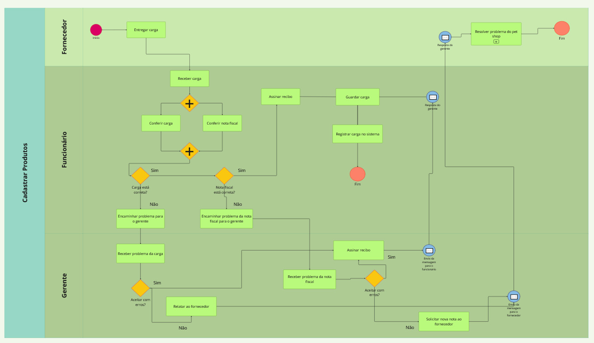
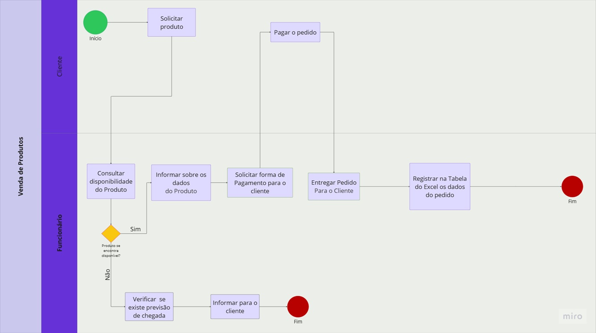

# Modelagem dos processos de negócio

Pré-requisitos: <a href="02-Especificacao.md"> Especificação do projeto</a>

## Modelagem da situação atual (Modelagem AS IS)

Descrição Textual dos Processos Atuais
1. Cadastro de Produtos:
Processo Atual:
- Recebimento da Carga: Quando uma nova carga de produtos chega ao pet shop, um funcionário é responsável por recebê-la.
- Conferência: O funcionário confere a carga recebida com a nota fiscal e assina o recibo para confirmar que tudo está em ordem.
- Armazenamento: Após a conferência, o funcionário guarda os produtos no estoque.
- Registro no Sistema: O funcionário precisa se deslocar até um computador para registrar manualmente cada produto no sistema de gestão do pet shop.
Problemas Identificados:
- Sobrecarga de Tarefas: Com o aumento do volume de produtos, os funcionários enfrentam uma sobrecarga de tarefas, resultando em desorganização.
- Gargalo no Cadastro: Se vários produtos chegam ao mesmo tempo, o processo de cadastro pode se tornar um gargalo, atrasando a atualização do estoque.
- Deslocamento Ineficiente: O deslocamento até o computador para registrar os produtos é ineficiente e consome tempo.
- Falta de Controle de Validade e Lotes: O sistema atual não controla a data de validade dos produtos nem os lotes, o que pode levar a perdas e desperdícios.
2. Registro de Pagamentos:
Processo Atual:
- Atendimento ao Cliente: O cliente chega ao pet shop e solicita um produto.
- Apresentação do Produto: O vendedor apresenta o produto ao cliente.
- Escolha da Forma de Pagamento: O cliente escolhe a forma de pagamento (dinheiro, cartão, etc.).
- Registro da Venda: O funcionário cobra a venda e registra os detalhes (data, valor, forma de pagamento) em uma planilha do Excel.
Problemas Identificados:
- Segurança: O Excel não é um local seguro para armazenar informações sensíveis como o histórico de vendas.
- Integridade dos Dados: O Excel não oferece proteção contra alterações não autorizadas, comprometendo a integridade dos dados.
- Operações Redundantes: O funcionário precisa realizar duas operações separadas: registrar a venda na planilha e dar baixa no estoque, aumentando a chance de erros.
3. Agendamento de Serviços:
Processo Atual:
- Solicitação de Serviços: Clientes solicitam serviços como banhos, tosas e consultas veterinárias.
- Gerenciamento Manual: A disponibilidade dos profissionais é gerenciada manualmente, sem um sistema eficiente para organizar os horários.
Problemas Identificados:
- Dificuldade no Encaixe de Horários: A falta de um sistema eficiente para gerenciar a disponibilidade dos profissionais causa dificuldades no agendamento de serviços.
- Desorganização: A gestão manual dos horários pode levar a conflitos de agenda e insatisfação dos clientes.
4. Programa de Fidelidade:
Situação Atual:
- Ausência de Programa: Atualmente, o pet shop não possui um programa de fidelidade para incentivar a retenção de clientes.
Problemas Identificados:
- Retenção de Clientes: A ausência de um programa de fidelidade dificulta a retenção de clientes e reduz as chances de retornos frequentes.
5. Supervisão à Distância:
Situação Atual:
- Acesso Limitado: O gerente não consegue acessar facilmente o status da loja pelo celular, limitando sua capacidade de supervisionar o pet shop à distância.
Problemas Identificados:
- Monitoramento Ineficiente: A falta de acesso remoto dificulta o acompanhamento do fluxo de atendimentos, verificação do estoque e monitoramento do desempenho geral do negócio em tempo real.

**Processo 1 - Cadastro de Produto**

**Processo 2 - Venda de Produto**

## Descrição geral da proposta (Modelagem TO BE)

Através da  análise dos processos AS-IS (Venda de Produtos e Cadastro de Produtos), foram identificados alguns gargalos: dependência de processos manuais, falhas na comunicação e registros paralelos em planilhas. Utilizando modelo TO BE é esperado automatizar estes processos, possibilitando a integração e oferecendo o controle centralizado da administração do petshop, otimizando as operações e promovendo melhor experiência tanto para os clientes quanto para os colaboradores da empresa.

**Processo 1 - Cadastro de Produto**

**Processo 2 - Venda de Produto**

[AS IS e TO BE - Venda de Produto.pdf](https://github.com/user-attachments/files/19694499/AS.IS.e.TO.BE.-.Venda.de.Produto.pdf)

**Oportunidades de melhoria de cada processo da solução proposta**
- Substituição do controle manual por sistema informatizado
  - Eliminação do uso de planilhas Excel para registro de vendas.
  - Implantação de um sistema de gestão de estoque que permite maior precisão, agilidade e segurança das informações.
- Criação de uma Lista de Desejos para produtos não disponíveis
  - Possibilidade de registrar a demanda de clientes por produtos que não estão disponíveis no momento.
  - Suporte à tomada de decisão do gerente na aquisição de novos produtos com base em dados reais de interesse dos clientes.
- Implementação de Lista de Notificação para produtos sem estoque
  - Caso o produto esteja cadastrado no sistema, mas indisponível no estoque, o cliente poderá se inscrever para ser notificado quando o item estiver disponível.
  - Melhoria na experiência do cliente, com aumento das chances de fidelização.
  - Redução da perda de vendas por indisponibilidade temporária de estoque.
- Maior controle e visibilidade do estoque em tempo real
  - Redução de erros manuais e falhas no controle de inventário.
  - Aumento da eficiência na reposição de produtos.
- Apoio à tomada de decisão estratégica
  - Geração de relatórios e históricos de vendas para melhor planejamento de compras.
  - Monitoramento da demanda de produtos com base nos registros da lista de desejos e notificações. 

## Modelagem dos processos

[Processo 1 – Cadastro de Produtos no Sistema](https://github.com/ICEI-PUC-Minas-PCO-SI/2025-1-p3-tiapn-si-grupo-6/blob/main/docs/processes/processo-1-Cadastro_de_produtos_no_sistema.md)

[PROCESSO 2 - Venda de Produtos](./processes/processo-2-nome-do-processo.md "Detalhamento do processo 2.")

## Indicadores de desempenho

Apresente aqui os principais indicadores de desempenho e algumas metas para o processo. Atenção: as informações necessárias para gerar os indicadores devem estar contempladas no diagrama de classe. Coloque no mínimo 5 indicadores.

Use o seguinte modelo:
**Processo 1 - Cadastro de Produto**
| **Indicador**                              | **Objetivo**                                                       | **Descrição**                                                                                   | **Fonte de Dados (Módulo ERP)**                     | **Fórmula de Cálculo**                                                   |
|--------------------------------------------|---------------------------------------------------------------------|--------------------------------------------------------------------------------------------------|----------------------------------------------------|-------------------------------------------------------------------------|
| Nível de satisfação do funcionário com o processo  | Avaliar a usabilidade e fluidez do sistema                     | Baseado em feedbacks e pesquisas com a equipe de cadastro                                            | Pesquisa interna                      |Média das notas atribuídas (escala de 1 a 5)              |
| Taxa de Atendimento de Requisições Internas| Medir a eficiência na resposta a solicitações entre setores        | Percentual de requisições internas concluídas                                                   | `Requisições`, `Usuários`, `Setores`               | `(nº de requisições atendidas / total de requisições) * 100`          |
| Tempo Médio de Reposição de Estoque        | Reduzir rupturas e melhorar a logística de reposição               | Tempo médio entre a falta e a reposição de um item no estoque                                   | `Estoque`, `Pedidos`, `Produtos`                   | `soma dos tempos de reposição / nº de produtos repostos`              |
| Conversão da Lista de Desejos              | Avaliar o potencial de vendas de produtos desejados                | Percentual de desejos que resultaram em vendas após disponibilidade do produto                 | `ListaDesejos`, `Produtos`, `Clientes`, `Vendas`   | `(nº de desejos comprados / nº total de desejos) * 100`               |
| Conversão da Notificação de Produto        | Medir a eficiência das notificações de disponibilidade em vendas   | Percentual de notificações de produto que geraram vendas                                        | `Notificações`, `Estoque`, `Vendas`                | `(nº de vendas após notificação / nº total de notificações enviadas) * 100` |

**Processo 2 - Venda de Produto**
| **Indicador**                              | **Objetivo**                                                       | **Descrição**                                                                                   | **Fonte de Dados (Módulo ERP)**                     | **Fórmula de Cálculo**                                                   |
|--------------------------------------------|---------------------------------------------------------------------|--------------------------------------------------------------------------------------------------|----------------------------------------------------|-------------------------------------------------------------------------|
| Percentual de Reclamações por Atendimento  | Avaliar a qualidade do atendimento ao cliente                      | Proporção de atendimentos que geraram reclamações                                               | `Atendimentos`, `Reclamações`                      | `(nº de reclamações / nº total de atendimentos) * 100`                 |
| Taxa de Atendimento de Requisições Internas| Medir a eficiência na resposta a solicitações entre setores        | Percentual de requisições internas concluídas                                                   | `Requisições`, `Usuários`, `Setores`               | `(nº de requisições atendidas / total de requisições) * 100`          |
| Tempo Médio de Reposição de Estoque        | Reduzir rupturas e melhorar a logística de reposição               | Tempo médio entre a falta e a reposição de um item no estoque                                   | `Estoque`, `Pedidos`, `Produtos`                   | `soma dos tempos de reposição / nº de produtos repostos`              |
| Conversão da Lista de Desejos              | Avaliar o potencial de vendas de produtos desejados                | Percentual de desejos que resultaram em vendas após disponibilidade do produto                 | `ListaDesejos`, `Produtos`, `Clientes`, `Vendas`   | `(nº de desejos comprados / nº total de desejos) * 100`               |
| Conversão da Notificação de Produto        | Medir a eficiência das notificações de disponibilidade em vendas   | Percentual de notificações de produto que geraram vendas                                        | `Notificações`, `Estoque`, `Vendas`                | `(nº de vendas após notificação / nº total de notificações enviadas) * 100` |

