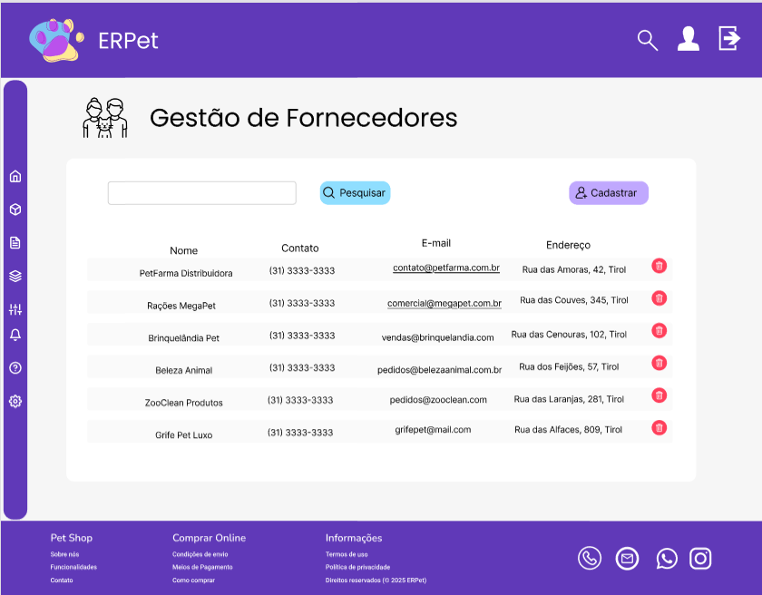

# Projeto de interface

A plataforma ERPet foi projetada para oferecer uma experiência simples, intuitiva e funcional, considerando o perfil dos usuários e os requisitos levantados na fase de especificação. A seguir, são apresentadas as principais telas do sistema, bem como a lógica de interação do usuário com as funcionalidades propostas.

A interface foi desenhada com base em princípios de usabilidade, acessibilidade e design responsivo, garantindo seu uso em computadores, tablets e smartphones. Dessa forma, tanto funcionários quanto gerentes podem utilizar o sistema de maneira eficiente, independentemente do dispositivo utilizado.

 ## User flow

    
    <strong>Figura:</strong> Userflow do sistema

### Diagrama de fluxo

O diagrama apresenta o estudo do fluxo de interação do usuário com o sistema interativo, muitas vezes sem a necessidade de desenhar o design das telas da interface. Isso permite que o design das interações seja bem planejado e tenha impacto na qualidade do design do wireframe interativo que será desenvolvido logo em seguida.

    
    <strong>Figura:</strong> Diagrama de fluxo do sistema

## Wireframes

### Landing Page

    

### Login

    

### Tela Inicial

    

### Gestão de Clientes

    

### Cadastro de Clientes

    

### Gestão de Fornecedor

    

### Cadastro de Fornecedor

    

### Gestão de Produtos

    

### Cadastro de Produtos

    

### Conferência XML

    

### Montar Pedido Compra

    

### Registro Venda

    

### Relatórios

    

### Gestão de Funcionários

    

### Cadastro Funcionários

    

## Interface do sistema

### Tela principal do sistema

Esta tela apresenta uma visão geral da média de vendas ao longo do ano e destaca os 10 produtos mais vendidos no mês. Também exibe uma lista de produtos com baixo estoque, cada um com um botão "Repor Estoque", que quando selecionado direciona para a página de Montagem de Pedido de Compra. Além disso, há uma seção dedicada a itens próximos da data de vencimento, indicando os respectivos percentuais de desconto aplicados. 

    

 ### Tela de Gestão de Cliente
 Esta tela apresenta os clientes que já foram cadastrados, com seus dados. O administrador pode pesquisar algum cliente especifico através da caixa de pesquisa, utilizar filtros, e, caso o cliente não esteja cadastrado ele pode clicar no botão de cadastro e ser redirecionado para a pagina de cadastro.

    

 ###  Tela de Cadastro de Cliente
 Esta tela apresenta os dados que devem ser preenchidos para realizar o cadastro do cliente do PetShop: nome completo, telefone, endereço, logradouro e email, caso o administrador queira salvar o cadastro ele deve clicar em cadastrar, se quiser cancelar, deve clicar em cancelar. O administrador poderá clicar no botão "ver clientes cadastrados" e será redirecionado para a pagina de lista de clientes já cadastrados. 

    

### Tela de Cadastro de Fornecedor
Permite o registro de novos fornecedores, incluindo dados como nome, CNPJ, endereço e observações.

    

### Tela de Gestão de Fornecedor
Exibe a lista de fornecedores cadastrados, com funcionalidades para buscar, editar ou remover fornecedores existentes.

    

### Tela de Cadastro de Produto
Formulário para cadastrar produtos com nome, descrição, categoria, preço, quantidade, validade, e link da imagem.

    

### Tela de Gestão de Produto
Lista os produtos cadastrados no sistema com possibilidade de filtrar, atualizar ou excluir registros.

    

### Tela de Conferência de XML
Permite o upload e leitura de arquivos XML de notas fiscais, exibindo informações importantes como produtos, valores e fornecedor. Faz a conferência automática de acordo com a ordem de compra selecionada e já é possível entrar com ela no sistema para atualizar os dados de produto e estoque.

    

### Tela de Montagem de Pedido de Compra
Permite criar e editar pedidos de compra, associando produtos, quantidades e fornecedor.

    

### Tela de Registro de Venda
Utilizada para registrar novas vendas, associando produtos e cliente, calculando valores totais e permitindo inserção de observações.

    

### Tela de Relatórios
Gera relatórios administrativos, como vendas por período, pedidos de compra, produtos cadastrados ou mais vendidos, e movimentação de funcionários.

    

### Landing page
Tela inicial pública do sistema, voltada para apresentação da plataforma. Exibe informações resumidas sobre os recursos do sistema, vantagens, diferenciais e contatos.

    

### Login
Tela responsável por autenticar os usuários do sistema. Nela, o funcionário (admin, gerente ou colaborador) insere seu nome de usuário e senha.

    

### Tela de Cadastro de Funcionários
Permitir cadastrar novos funcionários no sistema, com informações essenciais para o gerenciamento da equipe.

    

### Tela de Gestão de Funcionários
Permitir visualizar, gerenciar e editar as informações dos funcionários cadastrados no sistema.

    

