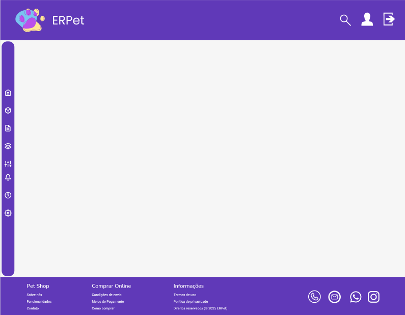
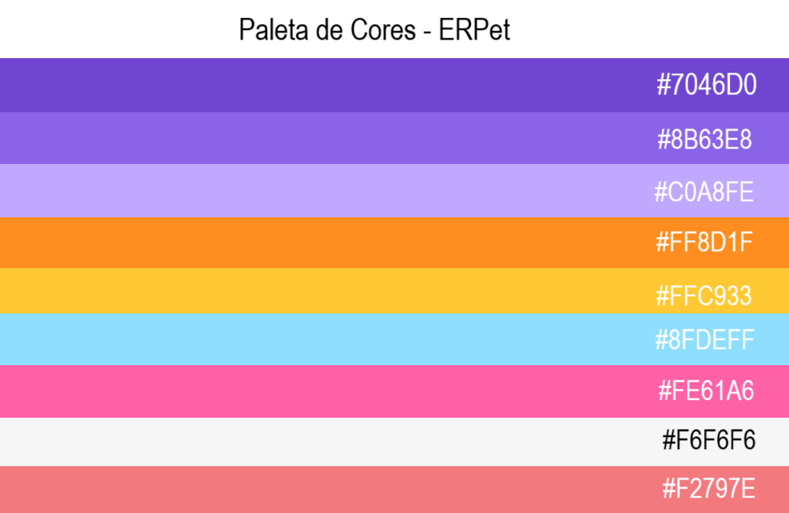

# Template padrão da aplicação

Layout padrão da aplicação que será utilizado em todas as páginas com a definição de identidade visual, aspectos de responsividade e iconografia.

  

  

## Fonte Utilizada
#### Fonte Principal: Poppins (Google Fonts)

### Variações:

**Poppins Regular (400)** - Usada para o texto principal (parágrafos, descrições, corpo do conteúdo).

**Poppins Medium (500)** - Usada para subtítulos e textos de destaque moderado.

**Poppins SemiBold (600)**  - Usada para subtítulos e botões.

**Poppins Bold (700)** - Usada para títulos principais e elementos que precisam de maior destaque.
