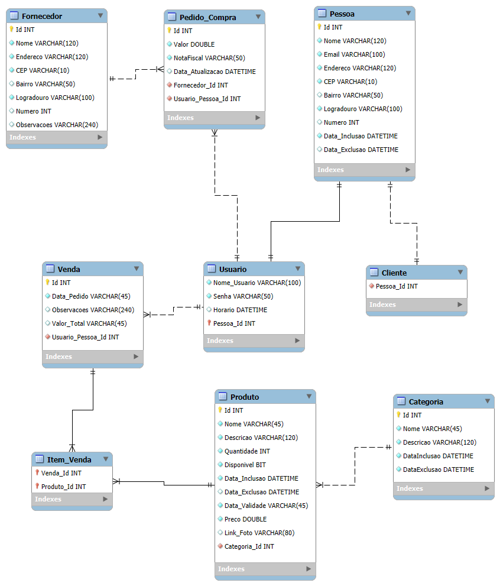

# Arquitetura da solução

<span style="color:red">Pré-requisitos: <a href="05-Projeto-interface.md"> Projeto de interface</a></span>

Definição de como o software é estruturado em termos dos componentes que fazem parte da solução e do ambiente de hospedagem da aplicação.


## Diagrama de classes

O diagrama de classes ilustra graficamente a estrutura do software e como cada uma das classes estará interligada. Essas classes servem de modelo para materializar os objetos que serão executados na memória.

> **Links úteis**:
> - [Diagramas de classes - documentação da IBM](https://www.ibm.com/docs/pt-br/rational-soft-arch/9.7.0?topic=diagrams-class)
> - [O que é um diagrama de classe UML?](https://www.lucidchart.com/pages/pt/o-que-e-diagrama-de-classe-uml)

##  Modelo de dados

O desenvolvimento da solução proposta requer a existência de bases de dados que permitam realizar o cadastro de dados e os controles associados aos processos identificados, assim como suas recuperações.

Utilizando a notação do DER (Diagrama Entidade-Relacionamento), elabore um modelo, usando alguma ferramenta, que contemple todas as entidades e atributos associados às atividades dos processos identificados. Deve ser gerado um único DER que suporte todos os processos escolhidos, visando, assim, uma base de dados integrada. O modelo deve contemplar também o controle de acesso dos usuários (partes interessadas nos processos) de acordo com os papéis definidos nos modelos do processo de negócio.

Apresente o modelo de dados por meio de um modelo relacional que contemple todos os conceitos e atributos apresentados na modelagem dos processos.

### Modelo ER

O Modelo ER representa, por meio de um diagrama, como as entidades (coisas, objetos) se relacionam entre si na aplicação interativa.

> **Links úteis**:
> - [Como fazer um diagrama entidade relacionamento](https://www.lucidchart.com/pages/pt/como-fazer-um-diagrama-entidade-relacionamento)

### Esquema relacional

<p align="center">
  
</p>

### Modelo físico

-- Criação da tabela Fornecedor
CREATE TABLE Fornecedor (
    Id INTEGER PRIMARY KEY,
    Nome VARCHAR(120) NOT NULL,
    Endereco VARCHAR(120) NOT NULL,
    CEP VARCHAR(10) NOT NULL,
    Bairro VARCHAR(50),
    Logradouro VARCHAR(100) NOT NULL,
    Numero INTEGER,
    Observacoes VARCHAR(240)
);

-- Criação da tabela Pessoa
CREATE TABLE Pessoa (
    Id INTEGER PRIMARY KEY,
    Nome VARCHAR(120) NOT NULL,
    Email VARCHAR(100) NOT NULL,
    Endereco VARCHAR(120) NOT NULL,
    CEP VARCHAR(10) NOT NULL,
    Bairro VARCHAR(50),
    Logradouro VARCHAR(100) NOT NULL,
    Numero INTEGER,
    Data_Inclusao DATETIME NOT NULL,
    Data_Exclusao DATETIME
);

-- Criação da tabela Usuario
CREATE TABLE Usuario (
    Nome_Usuario VARCHAR(100) NOT NULL,
    Senha VARCHAR(50) NOT NULL,
    Horario DATETIME,
    Pessoa_Id INTEGER PRIMARY KEY,
    FOREIGN KEY (Pessoa_Id) REFERENCES Pessoa(Id)
);

-- Criação da tabela Cliente
CREATE TABLE Cliente (
    Pessoa_Id INTEGER,
    FOREIGN KEY (Pessoa_Id) REFERENCES Pessoa(Id)
);

-- Criação da tabela Pedido_Compra
CREATE TABLE Pedido_Compra (
    Id INTEGER PRIMARY KEY,
    Valor DOUBLE NOT NULL,
    NotaFiscal VARCHAR(50) NOT NULL,
    Data_Atualizacao DATETIME,
    Fornecedor_Id INTEGER NOT NULL,
    Usuario_Pessoa_Id INTEGER NOT NULL,
    FOREIGN KEY (Fornecedor_Id) REFERENCES Fornecedor(Id),
    FOREIGN KEY (Usuario_Pessoa_Id) REFERENCES Usuario(Pessoa_Id)
);

-- Criação da tabela Venda
CREATE TABLE Venda (
    Id INTEGER PRIMARY KEY,
    Data_Pedido VARCHAR(45) NOT NULL,
    Observacoes VARCHAR(240),
    Valor_Total VARCHAR(45),
    Usuario_Pessoa_Id INTEGER NOT NULL,
    FOREIGN KEY (Usuario_Pessoa_Id) REFERENCES Usuario(Pessoa_Id)
);

-- Criação da tabela Categoria
CREATE TABLE Categoria (
    Id INTEGER PRIMARY KEY,
    Nome VARCHAR(45) NOT NULL,
    Descricao VARCHAR(120) NOT NULL,
    DataInclusao DATETIME NOT NULL,
    DataExclusao DATETIME NOT NULL
);

-- Criação da tabela Produto
CREATE TABLE Produto (
    Id INTEGER PRIMARY KEY,
    Nome VARCHAR(45) NOT NULL,
    Descricao VARCHAR(120) NOT NULL,
    Quantidade INTEGER NOT NULL,
    Disponivel BIT NOT NULL,
    Data_Inclusao DATETIME NOT NULL,
    Data_Exclusao DATETIME,
    Data_Validade VARCHAR(45) NOT NULL,
    Preco DOUBLE NOT NULL,
    Link_Foto VARCHAR(80),
    Categoria_Id INTEGER NOT NULL,
    FOREIGN KEY (Categoria_Id) REFERENCES Categoria(Id)
);

-- Criação da tabela Item_Venda
CREATE TABLE Item_Venda (
    Venda_Id INTEGER,
    Produto_Id INTEGER,
    PRIMARY KEY (Venda_Id, Produto_Id),
    FOREIGN KEY (Venda_Id) REFERENCES Venda(Id),
    FOREIGN KEY (Produto_Id) REFERENCES Produto(Id)
);
```
Esse script deverá ser incluído em um arquivo .sql na pasta [de scripts SQL](../src/db).


## Tecnologias

Descreva qual(is) tecnologias você vai usar para resolver o seu problema, ou seja, implementar a sua solução. Liste todas as tecnologias envolvidas, linguagens a serem utilizadas, serviços web, frameworks, bibliotecas, IDEs de desenvolvimento, e ferramentas.

Apresente também uma figura explicando como as tecnologias estão relacionadas ou como uma interação do usuário com o sistema vai ser conduzida, por onde ela passa até retornar uma resposta ao usuário.


| **Dimensão**   | **Tecnologia**  |
| ---            | ---             |
| Front-end      | HTML + CSS + JS + React |
| Back-end       | Node.js         |
| SGBD           | MySQL           |
| Deploy         | Vercel          |


## Hospedagem

Explique como a hospedagem e o lançamento da plataforma foram realizados.

> **Links úteis**:
> - [Website com GitHub Pages](https://pages.github.com/)
> - [Programação colaborativa com Repl.it](https://repl.it/)
> - [Getting started with Heroku](https://devcenter.heroku.com/start)
> - [Publicando seu site no Heroku](http://pythonclub.com.br/publicando-seu-hello-world-no-heroku.html)

## Qualidade de software

Conceituar qualidade é uma tarefa complexa, mas ela pode ser vista como um método gerencial que, por meio de procedimentos disseminados por toda a organização, busca garantir um produto final que satisfaça às expectativas dos stakeholders.

No contexto do desenvolvimento de software, qualidade pode ser entendida como um conjunto de características a serem atendidas, de modo que o produto de software atenda às necessidades de seus usuários. Entretanto, esse nível de satisfação nem sempre é alcançado de forma espontânea, devendo ser continuamente construído. Assim, a qualidade do produto depende fortemente do seu respectivo processo de desenvolvimento.

A norma internacional ISO/IEC 25010, que é uma atualização da ISO/IEC 9126, define oito características e 30 subcaracterísticas de qualidade para produtos de software. Com base nessas características e nas respectivas subcaracterísticas, identifique as subcaracterísticas que sua equipe utilizará como base para nortear o desenvolvimento do projeto de software, considerando alguns aspectos simples de qualidade. Justifique as subcaracterísticas escolhidas pelo time e elenque as métricas que permitirão à equipe avaliar os objetos de interesse.

> **Links úteis**:
> - [ISO/IEC 25010:2011 - Systems and Software Engineering — Systems and Software Quality Requirements and Evaluation (SQuaRE) — System and Software Quality Models](https://www.iso.org/standard/35733.html/)
> - [Análise sobre a ISO 9126 – NBR 13596](https://www.tiespecialistas.com.br/analise-sobre-iso-9126-nbr-13596/)
> - [Qualidade de software - Engenharia de Software](https://www.devmedia.com.br/qualidade-de-software-engenharia-de-software-29/18209)
