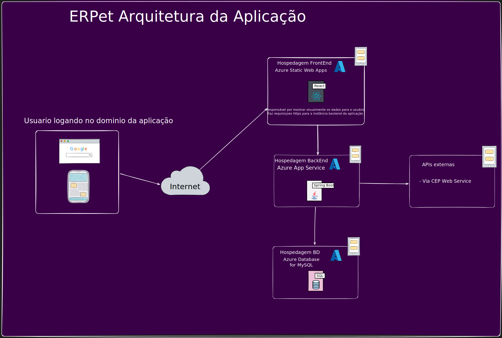
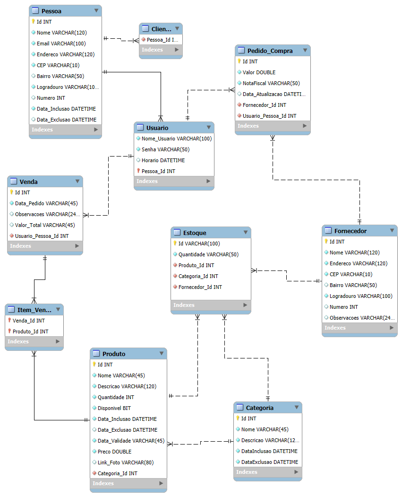

# Arquitetura da solução


<p align="center">
   <br/>
    <strong>Figura:</strong> Diagrama mostrando a arquitetura da solução
</p>


## Diagrama de classes


[](https://github.com/ICEI-PUC-Minas-PCO-SI/2025-1-p3-tiapn-si-grupo-6/blob/main/docs/images/Diagrama%20de%20classes%20ERPet.svg)

##  Modelo de dados

### Modelo ER


O diagrama entidade-relacionamento apresentado acima representa o modelo conceitual do sistema ERPET. Ele foi desenvolvido para dar suporte aos principais processos do sistema, como o controle de estoque, a gestão de vendas e pedidos, além do gerenciamento de usuários. A ideia por trás do modelo é garantir que todas essas informações estejam bem organizadas e conectadas, formando uma base de dados única, consistente e fácil de expandir conforme o sistema evolui.


### Esquema relacional

<p align="center">
  
</p>

### Modelo físico

```sql
-- MySQL Script generated by MySQL Workbench
-- Thu May  8 23:29:28 2025
-- Model: New Model    Version: 1.0
-- MySQL Workbench Forward Engineering

SET @OLD_UNIQUE_CHECKS=@@UNIQUE_CHECKS, UNIQUE_CHECKS=0;
SET @OLD_FOREIGN_KEY_CHECKS=@@FOREIGN_KEY_CHECKS, FOREIGN_KEY_CHECKS=0;
SET @OLD_SQL_MODE=@@SQL_MODE, SQL_MODE='ONLY_FULL_GROUP_BY,STRICT_TRANS_TABLES,NO_ZERO_IN_DATE,NO_ZERO_DATE,ERROR_FOR_DIVISION_BY_ZERO,NO_ENGINE_SUBSTITUTION';

-- -----------------------------------------------------
-- Schema mydb
-- -----------------------------------------------------

DROP SCHEMA IF EXISTS mydb;
CREATE SCHEMA mydb 
  DEFAULT CHARACTER SET utf8mb4
  DEFAULT COLLATE utf8mb4_general_ci;
USE mydb;

-- -------------------------------
-- Tabela Fornecedor
-- -------------------------------
CREATE TABLE Fornecedor (
  Id INT NOT NULL PRIMARY KEY,
  Nome VARCHAR(120) NOT NULL,
  Endereco VARCHAR(120) NOT NULL,
  CEP VARCHAR(10) NOT NULL,
  Bairro VARCHAR(50),
  Logradouro VARCHAR(100) NOT NULL,
  Numero INT,
  Observacoes VARCHAR(240),
  Data_Inclusao DATETIME NOT NULL,
  Data_Exclusao DATETIME
)ENGINE=InnoDB;

-- -------------------------------
-- Tabela Usuario
-- -------------------------------
CREATE TABLE Usuario (
  Id INT NOT NULL PRIMARY KEY,
  Nome VARCHAR(120) NOT NULL,
  Email VARCHAR(100) NOT NULL,
  Endereco VARCHAR(120) NOT NULL,
  CEP VARCHAR(10) NOT NULL,
  Bairro VARCHAR(50),
  Logradouro VARCHAR(100) NOT NULL,
  Numero INT,
  Login VARCHAR(100) NOT NULL,
  Senha VARCHAR(255) NOT NULL,
  Data_Inclusao DATETIME NOT NULL,
  Data_Exclusao DATETIME
)ENGINE=InnoDB;

-- -------------------------------
-- Tabela Cliente
-- -------------------------------
CREATE TABLE Cliente (
  Id INT NOT NULL PRIMARY KEY,
  Nome VARCHAR(120) NOT NULL,
  Email VARCHAR(100) NOT NULL,
  Endereco VARCHAR(120) NOT NULL,
  CEP VARCHAR(10) NOT NULL,
  Bairro VARCHAR(50),
  Logradouro VARCHAR(100) NOT NULL,
  Numero INT,
  Data_Inclusao DATETIME NOT NULL,
  Data_Exclusao DATETIME
)ENGINE=InnoDB;

-- -------------------------------
-- Tabela Categoria
-- -------------------------------
CREATE TABLE Categoria (
  Id INT NOT NULL PRIMARY KEY,
  Nome VARCHAR(45) NOT NULL,
  Descricao VARCHAR(120) NOT NULL,
  Data_Inclusao DATETIME NOT NULL,
  Data_Exclusao DATETIME 
)ENGINE=InnoDB;

-- -------------------------------
-- Tabela Produto
-- -------------------------------
CREATE TABLE Produto (
  Id INT NOT NULL PRIMARY KEY,
  Nome VARCHAR(45) NOT NULL,
  Descricao VARCHAR(120) NOT NULL,
  Quantidade INT NOT NULL,
  Disponivel BIT NOT NULL,
  Data_Inclusao DATETIME NOT NULL,
  Data_Exclusao DATETIME,
  Data_Validade VARCHAR(45) NOT NULL,
  Preco DOUBLE NOT NULL,
  Link_Foto VARCHAR(80),
  Categoria_Id INT NOT NULL,
  CONSTRAINT fk_Produto_Categoria1 FOREIGN KEY (Categoria_Id)
    REFERENCES Categoria(Id)
    ON DELETE NO ACTION ON UPDATE NO ACTION
)ENGINE=InnoDB;

-- -------------------------------
-- Tabela Pedido_Compra
-- -------------------------------
CREATE TABLE Pedido_Compra (
  Id INT NOT NULL PRIMARY KEY,
  Valor DOUBLE NOT NULL,
  NotaFiscal VARCHAR(50) NOT NULL,
  Data_Atualizacao DATETIME,
  Fornecedor_Id INT NOT NULL,
  Usuario_Id INT NOT NULL,
  CONSTRAINT fk_Pedido_Compra_Fornecedor1 FOREIGN KEY (Fornecedor_Id)
    REFERENCES Fornecedor(Id)
    ON DELETE NO ACTION ON UPDATE NO ACTION,
  CONSTRAINT fk_Pedido_Compra_Usuario1 FOREIGN KEY (Usuario_Id)
    REFERENCES Usuario(Id)
    ON DELETE NO ACTION ON UPDATE NO ACTION
)ENGINE=InnoDB;

-- -------------------------------
-- Tabela Venda (Cliente compra, Usuario vende)
-- -------------------------------
CREATE TABLE Venda (
  Id INT NOT NULL PRIMARY KEY,
  Data_Pedido DATETIME NOT NULL,
  Observacoes VARCHAR(240),
  Valor_Total DOUBLE,
  Cliente_Id INT NOT NULL,
  Usuario_Id INT NOT NULL,
  CONSTRAINT fk_Venda_Cliente FOREIGN KEY (Cliente_Id)
    REFERENCES Cliente(Id)
    ON DELETE NO ACTION ON UPDATE NO ACTION,
  CONSTRAINT fk_Venda_Usuario FOREIGN KEY (Usuario_Id)
    REFERENCES Usuario(Id)
    ON DELETE NO ACTION ON UPDATE NO ACTION
)ENGINE=InnoDB;

-- -------------------------------
-- Tabela Item_Venda
-- -------------------------------
CREATE TABLE Item_Venda (
  Venda_Id INT NOT NULL,
  Produto_Id INT NOT NULL,
  Valor_Unitario DOUBLE NOT NULL,  
  Quantidade INT NOT NULL,
  Valor_Total DOUBLE GENERATED ALWAYS AS (`Valor_Unitario` * `Quantidade`) STORED,
  PRIMARY KEY (Venda_Id, Produto_Id),
  CONSTRAINT fk_Item_Venda_Venda FOREIGN KEY (Venda_Id)
    REFERENCES Venda(Id)
    ON DELETE NO ACTION ON UPDATE NO ACTION,
  CONSTRAINT fk_Item_Venda_Produto FOREIGN KEY (Produto_Id)
    REFERENCES Produto(Id)
    ON DELETE NO ACTION ON UPDATE NO ACTION
)ENGINE=InnoDB;

-- -------------------------------
-- Tabela Estoque
-- -------------------------------
CREATE TABLE Estoque (
  Id VARCHAR(100) NOT NULL PRIMARY KEY,
  Quantidade VARCHAR(50) NOT NULL,
  Produto_Id INT NOT NULL,
  Categoria_Id INT NOT NULL,
  Fornecedor_Id INT NOT NULL,
  CONSTRAINT fk_Estoque_Produto FOREIGN KEY (Produto_Id)
    REFERENCES Produto(Id)
    ON DELETE NO ACTION ON UPDATE NO ACTION,
  CONSTRAINT fk_Estoque_Categoria FOREIGN KEY (Categoria_Id)
    REFERENCES Categoria(Id)
    ON DELETE NO ACTION ON UPDATE NO ACTION,
  CONSTRAINT fk_Estoque_Fornecedor FOREIGN KEY (Fornecedor_Id)
    REFERENCES Fornecedor(Id)
    ON DELETE NO ACTION ON UPDATE NO ACTION
)ENGINE=InnoDB;


SET SQL_MODE=@OLD_SQL_MODE;
SET FOREIGN_KEY_CHECKS=@OLD_FOREIGN_KEY_CHECKS;
SET UNIQUE_CHECKS=@OLD_UNIQUE_CHECKS;

```

## Tecnologias

A aplicação é estruturada em uma arquitetura de três camadas principais: frontend, backend e banco de dados, todos hospedados na plataforma Microsoft Azure.

O frontend será desenvolvido utilizando a linguagem JavaScript na especificação ES2023, por ser amplamente consolidada e atualizada, além de estar presente em praticamente toda a web moderna. Será utilizado o framework React para permitir o desenvolvimento baseado em Single Page Application (SPA), o que garante melhor desempenho e experiência de usuário. Para a estruturação visual, serão utilizadas as tecnologias HTML5 e CSS3, com o auxílio do Bootstrap para garantir responsividade e uma estilização consistente em diferentes dispositivos.

O backend será implementado com a linguagem Java 21, versão LTS (Long-Term Support), o que garante atualizações e estabilidade por muitos anos, tornando-a uma escolha robusta e altamente portátil no mercado. O framework escolhido é o Spring Boot, na versão 3.4.5 (mais estável até a data atual), que oferece agilidade no desenvolvimento, embarca um servidor Apache Tomcat e permite fácil integração com outras ferramentas do ecossistema. O uso do Spring Data JPA facilita a persistência de dados e abstrai o acesso ao banco, enquanto o MySQL Driver garante uma conexão eficiente e estável com o banco de dados. O gerenciamento de dependências será feito com o Maven, que contribui para a escalabilidade, organização e evolução contínua do sistema.

A camada de persistência de dados será gerenciada por um banco de dados MySQL 8.0, escolhido pela sua maturidade, performance e compatibilidade com o Spring. A ferramenta MySQL Workbench será utilizada para gerenciamento visual, permitindo que a equipe desenvolvedora edite tabelas, colunas e dados sem a necessidade de escrever queries diretamente, otimizando tempo e clareza no desenvolvimento.

Em relação às ferramentas de desenvolvimento, será permitida liberdade de escolha da IDE, desde que esta ofereça suporte à linguagem Java e ao servidor embutido no Spring Boot. A preferência da equipe é pelo uso do Visual Studio Code, pela sua leveza e capacidade de rodar tanto o frontend quanto o backend. No entanto, IDEs como IntelliJ IDEA, Eclipse e NetBeans também são opções viáveis. Para testar as requisições HTTP e APIs REST, será utilizado o Postman ou o APIDog — este último se destaca pela possibilidade futura de geração automática de documentação da API.


| **Dimensão**   | **Tecnologia**  |
| ---            | ---             |
| Front-end      | HTML + CSS + JS + React |
| Back-end       | Java + SpringBoot         |
| SGBD           | MySQL           |
| Deploy         | Azure          |


## Hospedagem

Durante o desenvolvimento inicial, o sistema vai ser executado localmente, permitindo testes rápidos e ajustes contínuos no ambiente de desenvolvimento. A aplicação web vai ser construída utilizando Java 21 com Spring Boot 3.4.5 no back-end e React com JavaScript ES2023 no front-end, garantindo uma base moderna e escalável.

Hospedagem na Nuvem (Azure)
Para o lançamento da plataforma, optou-se por utilizar a nuvem da Microsoft Azure, devido à sua confiabilidade, escalabilidade e integração com ferramentas de desenvolvimento modernas.


## Qualidade de software

| **Característica ISO**           | **Subcaracterística**  |  **Justificativa** | **Métrica**  |
| ---                              |  ---                   |    ---             |    ---       |
|Adequação Funcional|Completude funcional|Cobrir todos os processos essenciais do petshop (agendamentos, estoque, vendas)|% de funcionalidades implementadas em relação às especificadas|
|Adequação Funcional|Correção funcional  | Resultados devem ser corretos (ex: valor da venda, horário disponível)        |Número de erros registrados durante testes funcionais         |
|Adequação Funcional|Apropriabilidade funcional|As funcionalidades devem atender diretamente as tarefas dos usuários|Grau de satisfação dos usuários por meio de questionários (escala 1–5) |
|Desempenho e Eficiência|Comportamento temporal| Respostas devem ser rápidas para evitar filas ou atrasos| Tempo médio de resposta por funcionalidade |
|Usabilidade                    |Apreensibilidade                |Funcionários sem formação técnica devem aprender o sistema com facilidade| Tempo médio para aprender a usar funções básicas|
|Usabilidade                    |Operacionalidade               |O fluxo de trabalho deve ser simples e intuitivo | Número de cliques/telas para concluir tarefas comuns|
|Usabilidade                  |Estética da interface do usuário | Interface agradável facilita o uso contínuo|Avaliação estética por grupo de usuários (escala 1–5) |
|Confiabilidade                |Disponibilidade                 | O sistema deve estar acessível durante todo o expediente | % de tempo em que o sistema permanece online (uptime)|
|Confiabilidade               |Tolerância a falhas              |O sistema deve continuar funcionando mesmo quando há falhas | % de falhas que o sistema consegue recuperar| automaticamente.
|Confiabilidade               |Recuperabilidade                 |Dados não devem ser perdidos em caso de falha|Tempo médio de recuperação após falha (MTTR)|
|Segurança                     |Confidencialidade               |Dados de clientes e financeiro devem estar protegidos|Número de acessos não autorizados detectados|
|Segurança                    |Autenticidade                    | Cada funcionário deve ter login próprio e rastreável|% de ações registradas com identificação do usuário|
|Manutenibilidade              |Modificabilidade                |O sistema deve permitir ajustes com baixo esforço |Tempo médio para implementar pequenas mudanças|
|Manutenibilidade              |Testabilidade                   |Mudanças devem ser facilmente testáveis | % de cobertura de testes automatizados|
|Portabilidade                 |Adaptabilidade                  |ERP deve funcionar em diferentes dispositivos (ex: desktop, tablet)| Número de plataformas suportadas com desempenho aceitável|
|Portabilidade                 |Instabilidade                   |O sistema deve ser fácil de instalar ou estar disponível via navegador|Tempo médio de instalação/configuração inicial.


