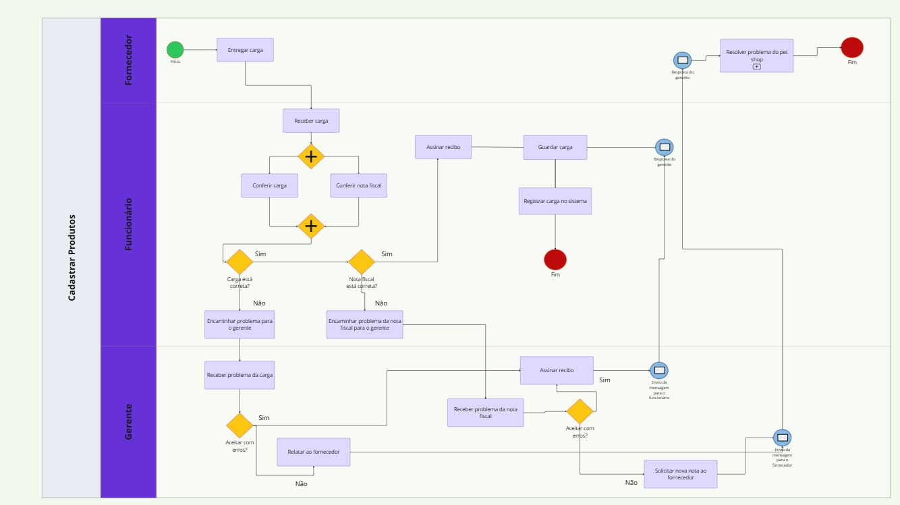
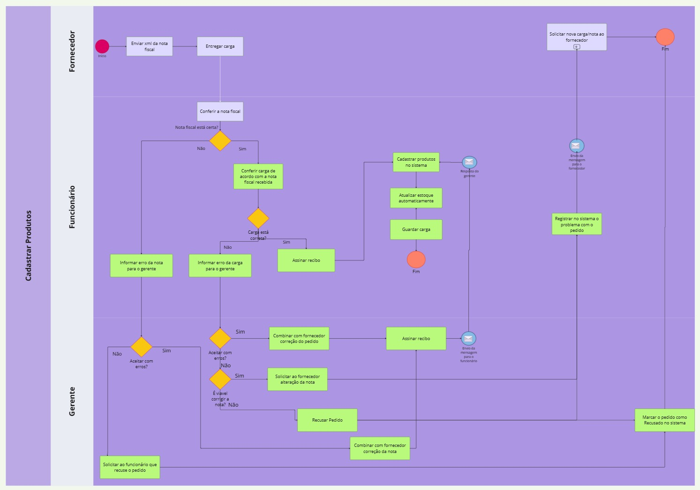

### 3.3.1 Processo 1 – Cadastro de Produtos no Sistema

Após a identificação dos gargalos presentes no modelo AS-IS, propomos uma solução baseada na melhoria do processo e com apoio de tecnologia, conforme representado no modelo TO-BE. Essa proposta busca tornar o processo de cadastro  e atualização do estoque de produtos e conferência de entregas mais ágil e confiável. 

**Oportunidades de melhoria:**
 
- Envio da nota fiscal (XML) pelo fornecedor antes da entrega, permitindo conferência prévia dos dados e facilitando a conferência da mercadoria. 
- Atualização automática do estoque, uma vez que os produtos foram cadastrados. 
- Registro automatizados de pedidos negados ou com problemas, reduzindo retrabalho e garantindo rastreabilidade. 
 
**Limites:**

 
A implementação da solução proposta requer a capacitação adequada dos funcionários para o uso correto do sistema, garantindo que todos os envolvidos estejam aptos a operar as novas funcionalidades de forma eficiente. Essa iniciativa está diretamente alinhada com as estratégias e objetivos do negócio, uma vez que promove maior agilidade e precisão nos processos logísticos, reduzindo significativamente o tempo necessário para o cadastro e o processamento de mercadorias. Além disso, contribui para a melhoria do controle de estoque, impactando positivamente nas reposições e na redução de perdas. Outro ponto importante é o aprimoramento da comunicação entre a equipe interna e os fornecedores, o que favorece uma resolução mais rápida de falhas e inconsistências nos processos operacionais.

 

  

<em>Figura 1 – Modelo BPMN do Processo 1 As-Is mostrando como normalmente ocorre no petshop</em>

  

<em>Figura 2 – Modelo BPMN do Processo 1  TO BE com as melhorias propostas pela equipe</em>

#### Detalhamento das atividades

**Atividade 1: Receber Nota Fiscal Eletrônica do Fornecedor** 

| **Campo**       | **Tipo**         | **Restrições** | **Valor default** |
| ---             | ---              | ---            | ---               |
| Número da NF-e |  	Caixa de texto |   	Apenas números, 44 dígitos |    |
| Data de emissão | Data | Obrigatório | |
| Arquivo XML da NF-e | Arquivo   | 	Apenas arquivos .xml |  |
| Nome do fornecedor | Caixa de Texto | mínimo de 8 caracteres |  |
| Valor total| Número| Apenas valores positivos |

| **Comandos**         |  **Destino**         | **Tipo** |
| ---                  |    ---               | ---      |
| Validar NF-e | Atividade 2: Conferir Entrega | default |
| Cancelar | Fim do processo | cancel |

**Atividade 2: Conferir Entrega de Produtos**

| **Campo**       | **Tipo**         | **Restrições** | **Valor default** |
| ---             | ---              | ---            | ---               |
| Data da conferência  | Data	       | Obrigatório    | Data atual        |
| Conferente responsável |	Seleção única	| Selecionar usuário do sistema	 | |
| Lista de produtos conferidos |	Tabela |	Deve conter código, descrição, qtde	||
| Discrepâncias encontradas? |	Seleção única	| Sim / Não |	Não|
| Justificativa (se discrepância)	| Área de texto	| Obrigatório se houver discrepância	||

| **Comandos**         |  **Destino**                   | **Tipo**          |
| ---                  | ---                            | ---               |
| Confirmar conferência |	Atualização automática do estoque |	default |
| Reportar problema	| Registro de pedido negado ou com problema	| |
| Voltar |	Atividade 1: Receber Nota Fiscal Eletrônica	| cancel |

**Atividade 3:  Cadastro Manual de Produto**
> **Obs:** quando um produto está na entrega, mas não consta na base de dados do sistema.

| **Campo**       | **Tipo**         | **Restrições** | **Valor default** |
| ---             | ---              | ---            | ---               |
| Código do produto |	Caixa de texto	| Obrigatório, único	|               |
| Nome do produto	| Caixa de texto	| Obrigatório |                        |
| Categoria |	Seleção única	| Selecionar entre categorias disponíveis |   |
| Unidade de medida	| Seleção única	| Ex: unidade, kg, pacote	| unidade   |
| Preço unitário |	Número	| Apenas valores positivos |                    |
| Descrição do produto	| Área de texto	| Opcional |                       |

| **Comandos**         |  **Destino**                   | **Tipo**          |
| ---                  | ---                            | ---               |
| Salvar e continuar	| Conferência de entrega | 	default |
|Cancelar	| Voltar para conferência	| cancel|

