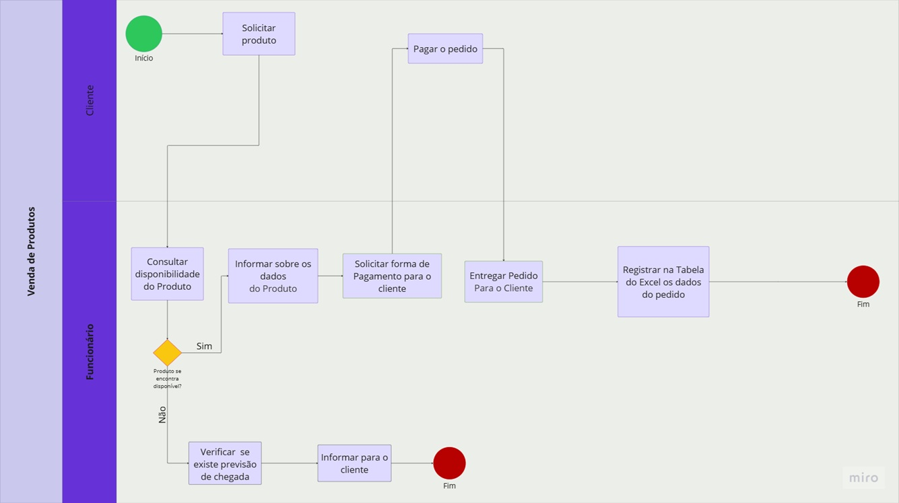
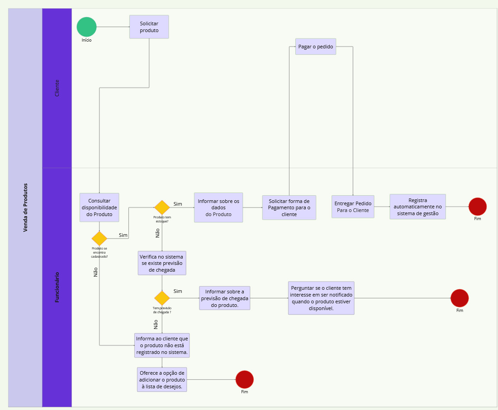

### 3.3.2 Processo 2 – Venda de Produtos no Sistema

Após a identificação dos gargalos presentes no modelo AS-IS, propomos uma solução baseada na melhoria do processo e com apoio de tecnologia, conforme representado no modelo TO-BE. Essa proposta busca tornar o processo de venda de produtos, consulta de disponilidade e atualização do estoque mais ágil e confiável.

**Oportunidades de melhoria:**

- Automatização do Registro**: Substituir o registro manual em Excel por um sistema integrado para reduzir erros e aumentar a eficiência.
- Automatização da Consulta de Disponibilidade**: Implementar integração em tempo real com o sistema de estoque para evitar verificações manuais. Adicionar opção de "notificação automática" quando o produto estiver disponível, eliminando a necessidade de o cliente retornar para consultar.
- Comunicação Proativa com o Cliente**: Permitir que o cliente escolha preferências de notificação (ex: WhatsApp, e-mail) durante a solicitação.
- Decisão Simplificada para Produto Indisponível**: Permitir que o cliente adicione o produto à lista de desejos caso ele não esteja disponível no estoque.

**Limites:**

A implementação do novo processo de vendas está condicionada à adequada capacitação dos funcionários, que deverão receber treinamento completo sobre a operação do sistema integrado, incluindo consulta automatizada de disponibilidade e gestão de notificações aos clientes, além de dispor de manuais operacionais detalhados, fluxogramas atualizados e materiais de apoio para solução de problemas.  Além disso, será necessário um treinamento para os clientes aprenderem a usar o novo processo no sistema ERP e manter a boa comunicação e suporte adequado caso aconteça qualquer problema.
Do ponto de vista técnico, será necessária a implantação de infraestrutura adequada, composta por sistema ERP integrado com módulo de vendas.

  

<em>Figura 1 – Modelo BPMN do Processo 1 As-Is mostrando como normalmente ocorre no petshop</em>

  

<em>Figura 2 – Modelo BPMN do Processo 1  TO BE com as melhorias propostas pela equipe</em>

#### Detalhamento das atividades

**Atividade 1: Solicitar Produto**

| **Campo**       | **Tipo**         | **Restrições** | **Valor default** |
| ---             | ---              | ---            | ---               |
| Código do Cliente | Número  |    Obrigatório            |                   |
| Nome do Cliente | Caixa de Texto  |    Obrigatório            |                  |
| Código do Produto | Número  |    Obrigatório            |   Mín. 1              |
| Quantidade | Número  |    Obrigatório            |   Mín. 1              |

| **Comandos**         |  **Destino**                   | **Tipo**          |
| ---                  | ---                            | ---               |
| Avançar | Consultar Disponibilidade  | default |
|  Cancelar      |   Fim do Processo (Cancelamento)       |     cancel              |

**Atividade 2: Consultar Disponibilidade**

| **Campo**       | **Tipo**         | **Restrições** | **Valor default** |
| ---             | ---              | ---            | ---               |
| Código do Produto | Número   | Obrigatório |                |
| Resultado Consulta   | Seleção Única   | "Disponível"/"Indisponível" (automático) |           |

| **Comandos**         |  **Destino**                   | **Tipo** |
| ---                  | ---                            | ---               |
| Avançar               | Informar Dados do Produto (se "Sim")              | default           |
| Notificar            | Registrar Interesse (se "Não")  |  cancel                 |

**Atividade 3: Solicitar pagamento**

| **Campo**       | **Tipo**         | **Restrições** | **Valor default** |
| ---             | ---              | ---            | ---               |
| Método de Pagamento | Seleção Única   | "Cartão", "PIX", "Boleto" |                |
| Valor Total   | Número   | "Disponível"/Calculado automaticamente |           |
| Dados do Cartão (se aplicável)   | Tabela   | Campos: Número, CVV, Validade (criptografados) |           |

| **Comandos**         |  **Destino**                   | **Tipo** |
| ---                  | ---                            | ---               |
| Confirmar pagamento     | Registrar Pedido no Sistema      | default           |
| Voltar            | Confirmar disponibilidade  |  cancel                 |

